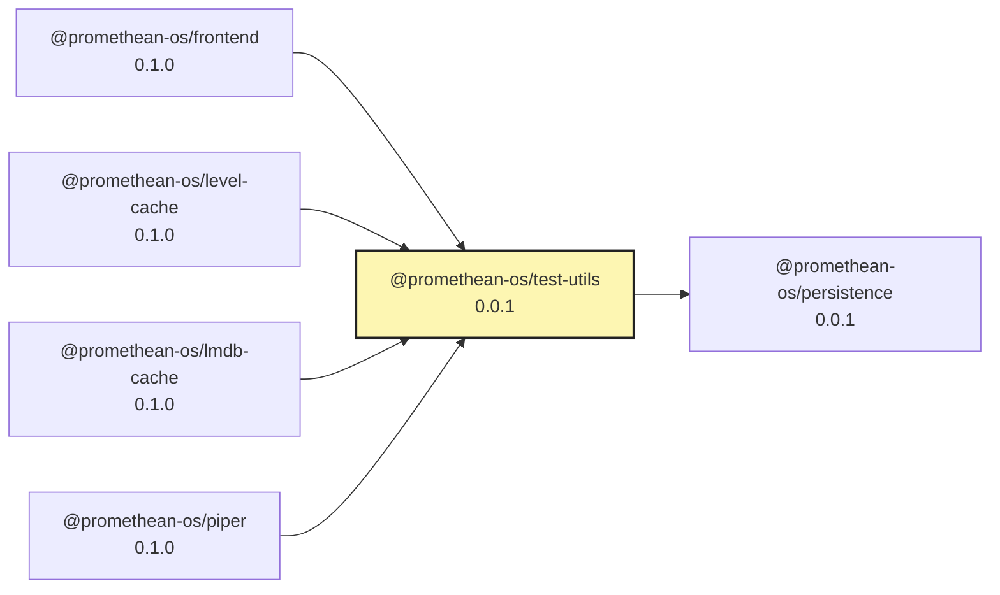

Test Utilities

- Persistence fakes: `test-utils/persistence`
  - `installInMemoryPersistence()` installs in-memory Mongo/Chroma clients used by shared persistence.
  - Returns `{ mongo, chroma, dispose }` for inspection and cleanup.

- Broker memory transport: `test-utils/broker`
  - Use by pointing broker clients to `BROKER_URL=memory://<ns>`.
  - The shared `BrokerClient` detects the `memory://` scheme and routes publish/subscribe via an in-process event bus.
  - Helpers:
    - `getMemoryBroker(ns)` returns the bus for the namespace.
    - `resetMemoryBroker(ns?)` resets a namespace or all.

These utilities enable unit tests to avoid network services while keeping integration tests free to use real WebSocket servers.

<!-- READMEFLOW:BEGIN -->
# @promethean-os/test-utils


[TOC]


## Install

```bash
pnpm -w add -D @promethean-os/test-utils
```

## Quickstart

```ts
// usage example
```

## Commands

- `build`
- `clean`
- `typecheck`
- `test`
- `lint`
- `coverage`
- `format`

## License

GPL-3.0-only


### Package graph




<!-- READMEFLOW:END -->
